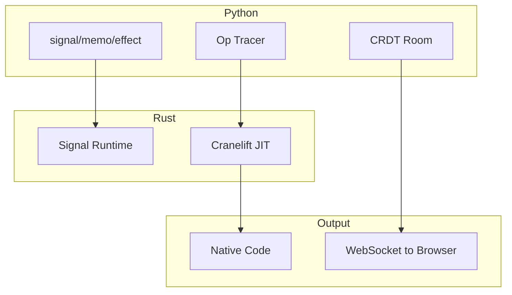

# Lattice

A reactive Python framework for building high-performance data applications with JIT compilation.

[](tests/)
[](https://python.org)
[](https://rust-lang.org)

## Why Lattice?

| Feature | Lattice | Streamlit | Dash | Reflex |
| ------- | ------- | --------- | ---- | ------ |
| **Reactivity** | Fine-grained | Full rerun | Callbacks | Fine-grained |
| **Speed** | **57x faster** | Baseline | ~1x | ~2x |
| **JIT Compilation** | **3000-5000x** | ❌ | ❌ | ❌ |
| **Real-time Collab** | **Built-in CRDT** | ❌ | ❌ | ❌ |
| **Rust Core** | ✅ PyO3 | ❌ | ❌ | ❌ |

**Lattice is the only Python UI framework with:**

- JIT compilation to native code (via Cranelift)
- CRDT-based real-time collaboration
- Rust-powered dependency tracking

## Quick Start

```bash
# Install
git clone https://github.com/matteso1/lattice
cd lattice/lattice-core
pip install maturin aiohttp pycrdt
maturin develop

# Run tests
pytest tests/ -v  # 71 tests
```

## Usage

```python
from lattice import signal, memo, effect

# Reactive state
count = signal(0)

@memo
def doubled():
    return count.value * 2

@effect
def log():
    print(f"Count: {count.value}, Doubled: {doubled()}")

count.value = 5  # Prints: "Count: 5, Doubled: 10"
```

## Performance Benchmarks

### Reactive Updates

| Metric | Result |
| ------ | ------ |
| Signal updates | **460,000/sec** |
| 10,000 signals | 9.85ms create |
| 100-deep memo chain | 0.19ms |
| 1000 effects | 1.46ms trigger |

### JIT Compilation (vs Python eval)

| Expression | Speedup |
| ---------- | ------- |
| x + y | **2,949x** |
| x * y + z | **3,390x** |
| (x + y) * (x - y) | **5,368x** |

### CRDT Sync

| Metric | Result |
| ------ | ------ |
| Sync throughput | **10,500 ops/sec** |
| 10 clients | All converged |

## Features

### 1. Fine-Grained Reactivity

Only recompute what changed:

```python
@memo
def expensive():
    return heavy_computation(data.value)

# Changes to `data` recompute `expensive`
# Changes to other signals → no recomputation
```

### 2. Real-Time Collaboration

Built-in CRDT sync (compatible with Yjs):

```python
from lattice.collab import Room, collaborative_signal

room = Room("my-room")
counter = collaborative_signal(room, "counter", 0)

# Updates sync across all clients
counter.value += 1
```

### 3. JIT Compilation

Trace Python → compile to native:

```python
from lattice.tracer import trace, TracedValue
from lattice._core import JitCompiler

with trace() as ctx:
    x = TracedValue(5.0, "x")
    result = x * x + 10
    ctx.set_output(result)

compiler = JitCompiler()
native_result = compiler.compile_and_run(ctx.to_ir(), [5.0])
# 3000x faster than Python!
```

## Demos

```bash
cd lattice-core && .\.venv\Scripts\activate

# JIT benchmark
python ..\examples\jit_benchmark.py

# Real-time dashboard (100+ signals)
python ..\examples\realtime_dashboard.py

# Stress test (10K signals)
python ..\examples\stress_test.py

# CRDT load test
python ..\examples\crdt_load_test.py
```

## Real-Time Collaboration: How It Works

### Local Development

The included WebSocket server works within the same network:

```python
python examples/collab_demo.py
# Open http://localhost:8003 in multiple tabs
```

### Production Deployment

For internet-wide collaboration, you need a sync server:

| Option | Description |
| ------ | ----------- |
| **y-websocket** | Host your own: `npx y-websocket` |
| **Liveblocks** | Managed service, easy setup |
| **PartyKit** | Edge-deployed, scales well |

The CRDT format (pycrdt) is Yjs-compatible, so any Yjs sync provider works.

## Publishing to PyPI

```bash
# Build wheel
cd lattice-core
maturin build --release

# Upload (after creating PyPI account)
pip install twine
twine upload target/wheels/*.whl
```

## Architecture



## Project Structure

```
lattice/
├── lattice-core/
│   ├── src/                  # Rust core
│   │   ├── reactive/         # Signal, Memo, Effect
│   │   └── jit/              # Cranelift JIT
│   ├── python/lattice/       # Python API
│   └── tests/                # 71 tests
└── examples/                 # Demo apps
```

## Contributing

PRs welcome! See [CONTRIBUTING.md](CONTRIBUTING.md).

## License

MIT License
