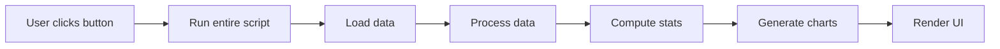
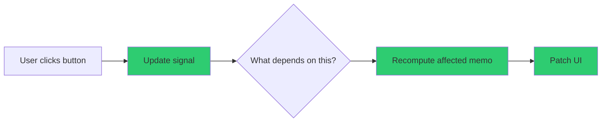
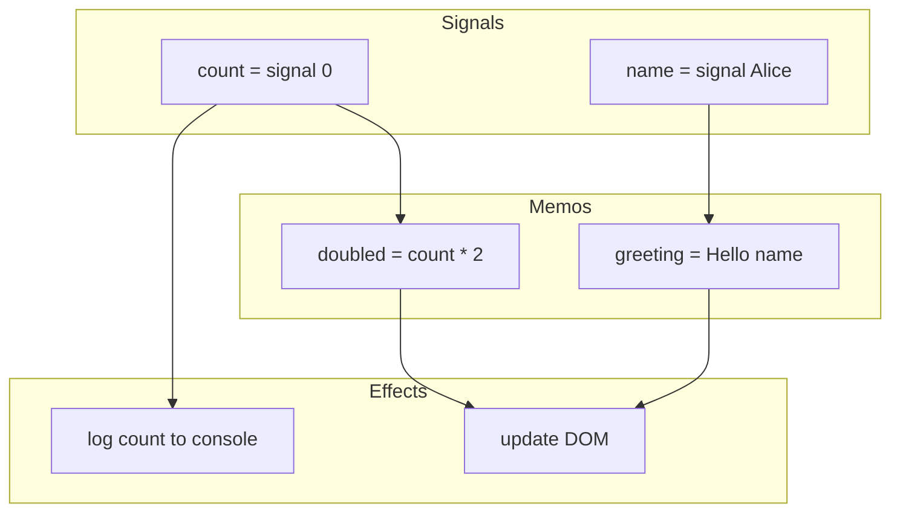
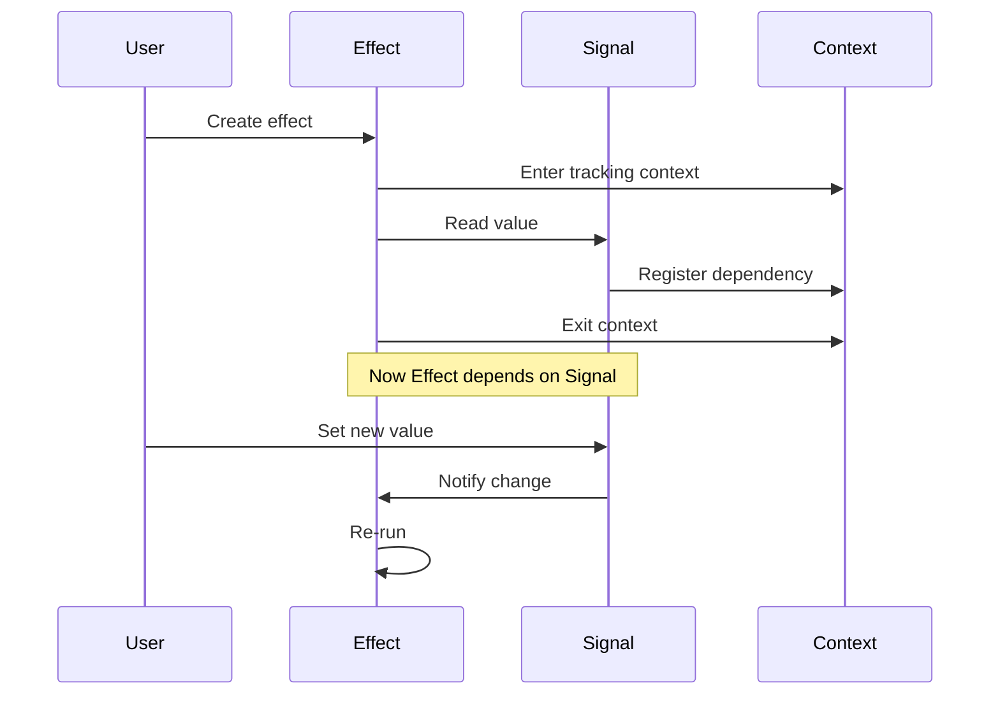
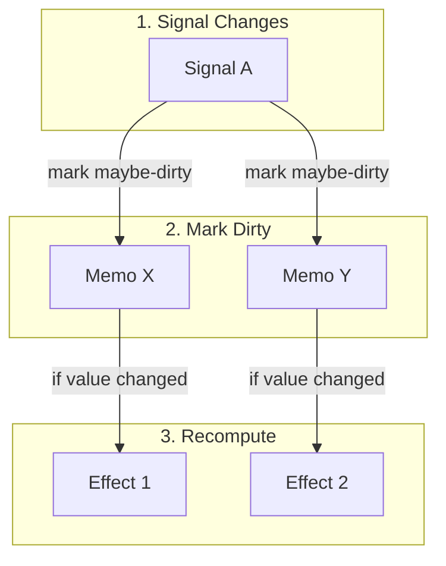
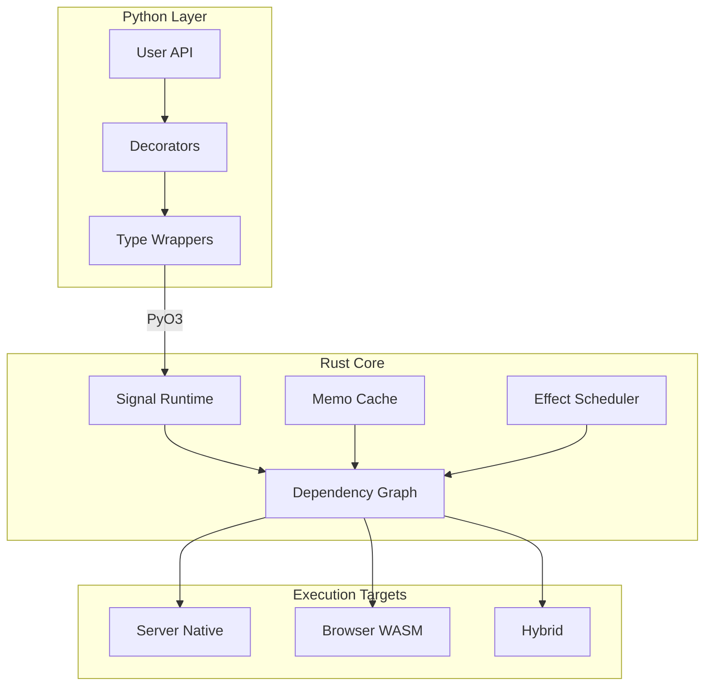
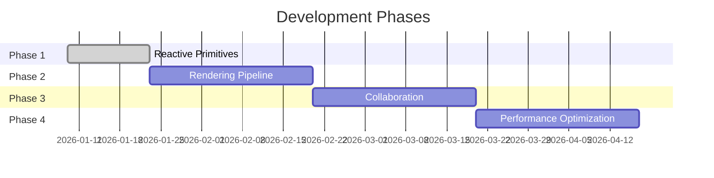

# Lattice

A reactive Python framework for building high-performance data applications.

## What is Lattice?

Lattice is a Python UI framework that uses **incremental computation** to make data applications fast. Instead of re-executing your entire program when something changes, Lattice tracks dependencies and updates only what needs updating.

## The Problem

Data application frameworks like Streamlit re-run your entire script on every user interaction:



This causes:

- **Slow interactions**: 100-500ms delays on every click
- **Wasted computation**: Recalculating unchanged values
- **Poor scalability**: Memory and CPU usage grows with complexity
- **No collaboration**: Each user session is isolated

## The Solution

Lattice only re-runs the code that depends on what changed:



Result: **Sub-10ms updates** instead of hundreds of milliseconds.

## How It Works

### Reactive Primitives

Lattice provides three core primitives:



**Signals** hold mutable state:

```python
from lattice import signal

count = signal(0)
count.value = 5  # Notifies all dependents
```

**Memos** cache derived values:

```python
from lattice import signal, memo

count = signal(0)

@memo
def doubled():
    return count.value * 2  # Only recomputes when count changes
```

**Effects** run side effects:

```python
from lattice import signal, effect

count = signal(0)

@effect
def log_changes():
    print(f"Count: {count.value}")  # Runs when count changes
```

### Dependency Tracking

When you read a signal inside a memo or effect, Lattice automatically records that dependency:



### Update Propagation

When a signal changes, updates flow through the dependency graph:



This is O(delta) complexity - proportional to what changed, not total program size.

## Architecture



### Why Rust?

The core is written in Rust for three reasons:

1. **Performance**: Native code, no interpreter overhead
2. **Parallelism**: No GIL, true multi-threading
3. **Safety**: Memory bugs caught at compile time

This follows the pattern used by Pydantic v2 (17x faster with Rust core), Polars, and Ruff.

## Project Structure

```
lattice/
    lattice-core/           # Rust crate
        src/
            lib.rs          # PyO3 module entry
            reactive/       # Signal, Memo, Effect
            graph/          # Dependency tracking
        python/
            lattice/        # Python API wrapper
    docs/                   # Documentation
    examples/               # Example apps
```

## Quick Start

### Prerequisites

- Rust 1.75+
- Python 3.11+
- maturin

### Installation

```bash
git clone https://github.com/matteso1/lattice
cd lattice/lattice-core
pip install maturin
maturin develop
```

### Usage

```python
from lattice import signal, memo, effect

# Create reactive state
count = signal(0)
name = signal("World")

# Derive computed values
@memo
def greeting():
    return f"Hello, {name.value}! Count: {count.value}"

# React to changes
@effect
def on_change():
    print(greeting())

# Update state
count.value = 1  # Prints: "Hello, World! Count: 1"
name.value = "Lattice"  # Prints: "Hello, Lattice! Count: 1"
```

## Roadmap



| Phase | Focus | Status |
| ----- | ----- | ------ |
| 1 | Reactive primitives (Signal, Memo, Effect) | In Progress |
| 2 | Rendering and WebSocket transport | Planned |
| 3 | CRDT-based collaboration | Planned |
| 4 | JIT compilation and optimization | Planned |

## Contributing

See [CONTRIBUTING.md](CONTRIBUTING.md) for development guidelines.

## License

MIT License. See [LICENSE](LICENSE).
