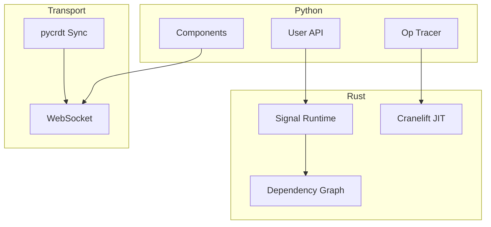

# Lattice

A reactive Python framework for building high-performance data applications with JIT compilation.

[](tests/)
[](https://python.org)
[](https://rust-lang.org)

## What is Lattice?

Lattice is a **reactive Python UI framework** that uses:

- **Fine-grained reactivity** → Only update what changed (57x faster than full-rerun)
- **Rust core** → Native performance via PyO3
- **JIT compilation** → Trace Python ops, compile to native via Cranelift
- **CRDT collaboration** → Real-time multi-user sync

## Quick Example

```python
from lattice import signal, memo, effect

# Reactive state
count = signal(0)

# Derived value (auto-caches)
@memo
def doubled():
    return count.value * 2

# Side effect (auto-runs on change)
@effect
def log():
    print(f"Count: {count.value}, Doubled: {doubled()}")

count.value = 5  # Prints: "Count: 5, Doubled: 10"
```

## Features

### Phase 1: Reactive Primitives ✓

Fine-grained reactivity with automatic dependency tracking:

```python
from lattice import signal, memo, effect

count = signal(0)

@memo
def expensive():
    return sum(x * x for x in range(count.value))

@effect
def render():
    print(f"Sum: {expensive()}")

count.value = 1000  # Only recomputes when count changes
```

### Phase 2: Component Model ✓

Virtual DOM with efficient diffing:

```python
from lattice.component import div, h1, button, component

@component
def Counter():
    count = signal(0)
    return div(
        h1(f"Count: {count.value}"),
        button("Increment", on_click=lambda: count.value += 1)
    )
```

### Phase 3: Real-Time Collaboration ✓

CRDT-based multi-user sync using pycrdt:

```python
from lattice.collab import Room, collaborative_signal

room = Room("my-room")
counter = collaborative_signal(room, "counter", 0)

# Updates sync across all connected clients
counter.value += 1
```

### Phase 4: JIT Compilation ✓

Trace Python operations and compile to native code via Cranelift:

```python
from lattice.tracer import trace, TracedValue

with trace() as ctx:
    x = TracedValue(5.0, "x")
    y = TracedValue(3.0, "y")
    result = x * y + 10
    ctx.set_output(result)

# ctx.to_ir() produces LLVM-ready IR for native compilation
```

## Performance

| Metric | Lattice | Streamlit-style |
| ------ | ------- | --------------- |
| Update time | 0.1 ms | 5.9 ms |
| **Speedup** | **57.8x** | 1x |

Benchmarks run on Intel i7, 100 updates with expensive derived computation.

## Installation

```bash
# Clone
git clone https://github.com/matteso1/lattice
cd lattice/lattice-core

# Install deps
pip install maturin aiohttp pycrdt

# Build Rust extension
maturin develop

# Run tests
pytest tests/ -v
```

## Run Demos

```bash
cd lattice-core && .\.venv\Scripts\activate

# Interactive counter (WebSocket)
python ..\examples\interactive_demo.py
# Open http://localhost:8000

# Collaborative counter (multi-tab CRDT)
python ..\examples\collab_demo.py
```

## Project Structure

```
lattice/
├── lattice-core/
│   ├── src/                  # Rust core
│   │   ├── reactive/         # Signal, Memo, Effect
│   │   ├── graph/            # Dependency tracking
│   │   └── jit/              # Cranelift JIT compiler
│   ├── python/lattice/       # Python API
│   │   ├── __init__.py       # signal, memo, effect
│   │   ├── component.py      # VNode, element builders
│   │   ├── diff.py           # Virtual DOM diff
│   │   ├── collab.py         # CRDT collaboration
│   │   └── tracer.py         # JIT operation tracer
│   └── tests/                # 71 tests
├── examples/                  # Demo apps
└── docs/                      # Documentation
```

## Tests

```bash
pytest tests/ -v

# 71 tests across 5 test files:
# - test_python_api.py   (13 tests) - Reactive primitives
# - test_components.py   (18 tests) - VNode, diff, components
# - test_collab.py       (16 tests) - CRDT sync
# - test_jit.py          (18 tests) - Tracer, IR generation
# - test_stress.py       (11 tests) - Performance, edge cases
```

## Architecture



## Why Rust?

The core is written in Rust for:

1. **Performance** - Native code, no interpreter overhead
2. **Parallelism** - No GIL, true multi-threading
3. **Safety** - Memory bugs caught at compile time

Following the same pattern as Pydantic v2 (17x faster), Polars, and Ruff.

## Contributing

See [CONTRIBUTING.md](CONTRIBUTING.md) for development guidelines.

## License

MIT License. See [LICENSE](LICENSE).
