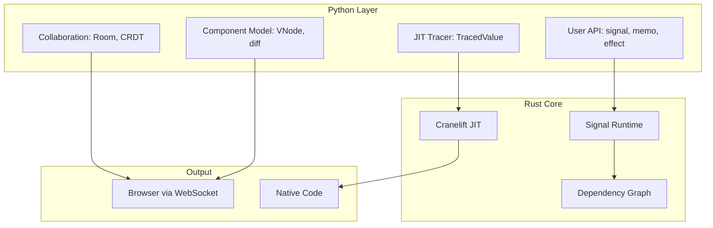
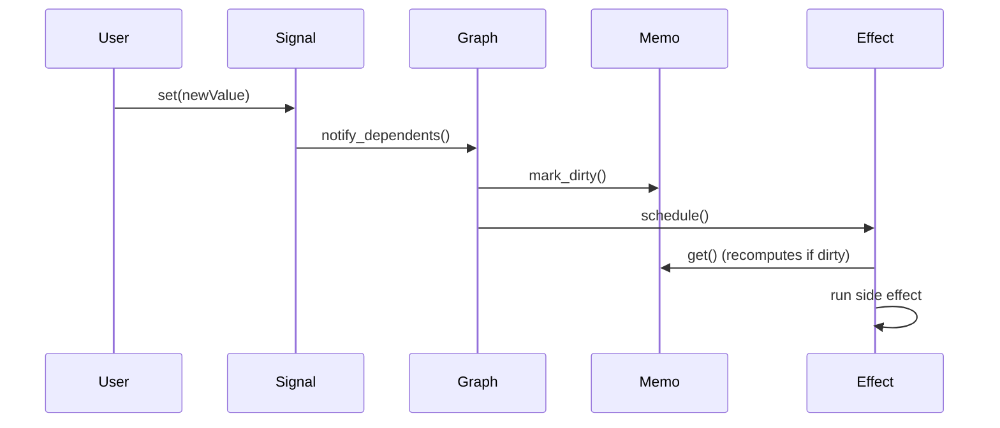

# Lattice Architecture

## Overview

Lattice is a hybrid Python/Rust framework with four core layers.

## Core Modules

### Phase 1: Reactive Runtime

| Module | Location | Purpose |
| ------ | -------- | ------- |
| Signal | `src/reactive/signal.rs` | Mutable state container |
| Memo | `python/lattice/__init__.py` | Cached derived values |
| Effect | `python/lattice/__init__.py` | Side effects on change |
| Runtime | `src/reactive/runtime.rs` | Dependency tracking |

### Phase 2: Component System

| Module | Location | Purpose |
| ------ | -------- | ------- |
| VNode | `python/lattice/component.py` | Virtual DOM node |
| Diff | `python/lattice/diff.py` | Tree diff algorithm |
| Server | `python/lattice/server.py` | WebSocket server |

### Phase 3: Collaboration

| Module | Location | Purpose |
| ------ | -------- | ------- |
| Room | `python/lattice/collab.py` | CRDT document wrapper |
| CollaborativeSignal | `python/lattice/collab.py` | Synced reactive state |

### Phase 4: JIT Compilation

| Module | Location | Purpose |
| ------ | -------- | ------- |
| Tracer | `python/lattice/tracer.py` | Python op tracing |
| IR | `src/jit/ir.rs` | Intermediate representation |
| Codegen | `src/jit/codegen.rs` | Cranelift compilation |

## Data Flow

## Design Decisions

### Why Rust Core?

- No GIL for true parallelism
- Native performance (10-100x Python)
- Memory safety guarantees

### Why Python API?

- Familiar syntax for data scientists
- Rich ecosystem integration
- Rapid prototyping

### Why Cranelift over LLVM?

- Pure Rust (no system dependencies)
- Fast compile times
- Used by rustc itself
