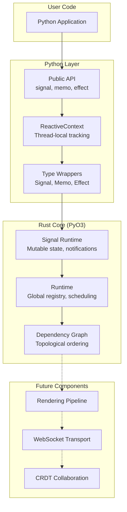
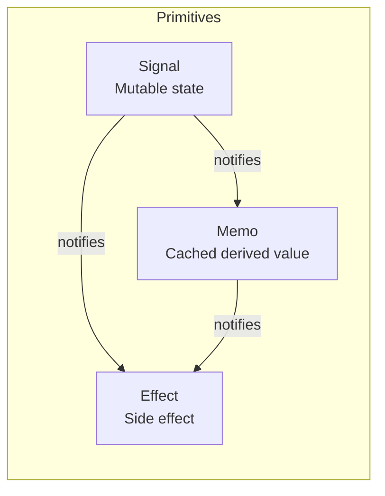
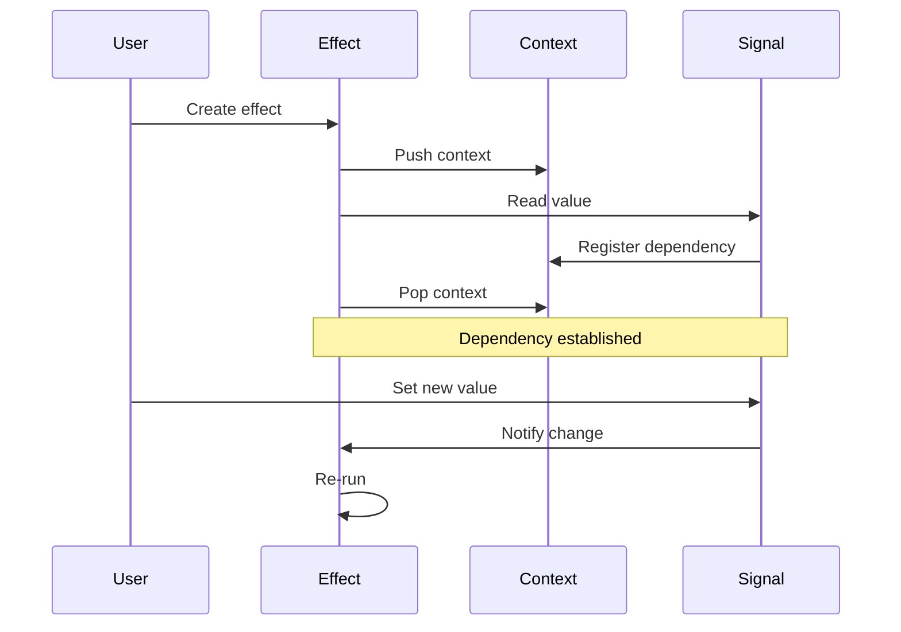
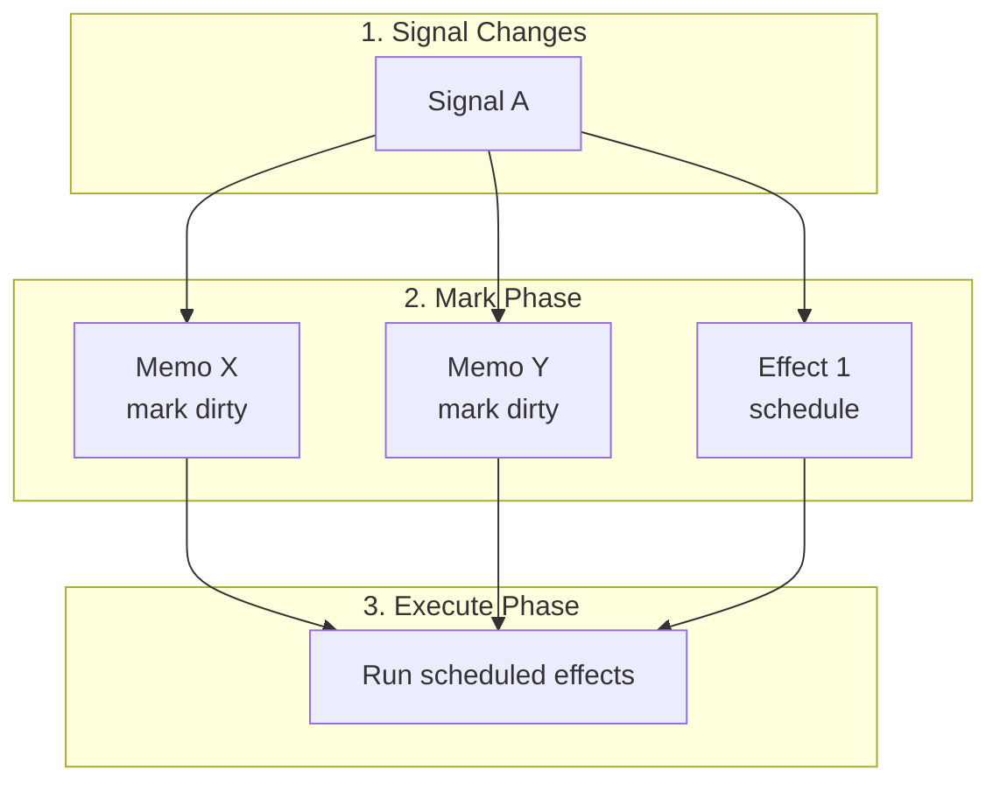
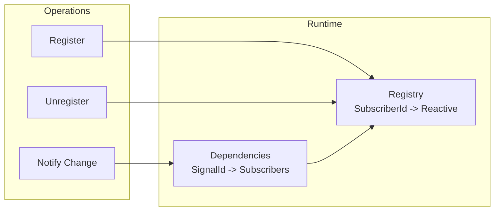
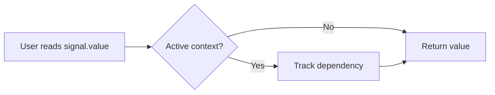
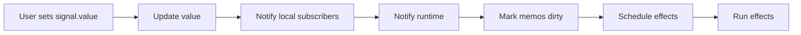
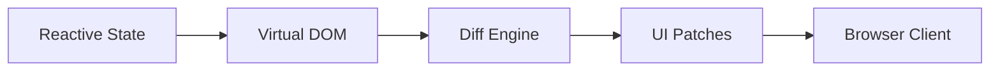
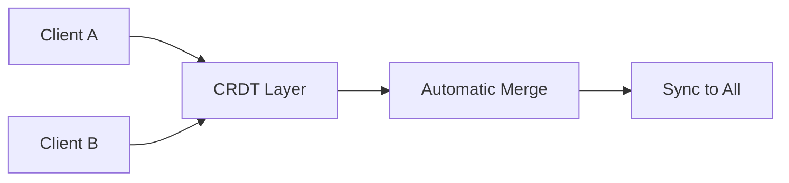

# Lattice Architecture

This document describes the technical architecture of Lattice, a reactive Python framework with a Rust-powered core.

## System Overview



## Core Components

### 1. Reactive Primitives

The foundation of Lattice is three reactive primitives:



| Primitive | Purpose | Evaluation | Thread-Safe |
| --------- | ------- | ---------- | ----------- |
| Signal | Hold mutable state | Immediate | Yes |
| Memo | Cache derived values | Lazy (on access) | Yes |
| Effect | Run side effects | Eager (on change) | Yes |

### 2. Dependency Tracking

Dependencies are tracked automatically using a context stack:



**Implementation:**

- Thread-local stack (`_ReactiveContext`)
- Each memo/effect pushes itself onto the stack
- Signal reads check the stack and register dependencies
- On pop, memo/effect subscribes to all tracked signals

### 3. Update Propagation

When a signal changes, updates propagate through the graph:



**Key behaviors:**

- Memos are lazy: marked dirty but not recomputed until accessed
- Effects are eager: scheduled and run immediately
- Diamond dependencies: handled correctly (each node runs once)

### 4. Runtime Registry

The global runtime tracks all reactive values:



**Data structures:**

- `OnceLock<RwLock<HashMap>>` for thread-safe lazy initialization
- Weak references to avoid preventing cleanup
- Automatic cleanup on handle drop

## Data Flow

### Read Path



### Write Path



## File Structure

```
lattice-core/
    src/
        lib.rs              # PyO3 module entry
        reactive/
            mod.rs          # Module exports
            signal.rs       # Signal<T> and PySignal
            memo.rs         # Memo<T> with caching
            effect.rs       # Effect with scheduling
            context.rs      # ReactiveContext stack
            runtime.rs      # Global registry
            subscriber.rs   # SubscriberId type
        graph/
            mod.rs          # Graph module
            node.rs         # Node types
            scheduler.rs    # Update scheduler
    python/
        lattice/
            __init__.py     # Python API
```

## Performance Characteristics

| Operation | Complexity | Notes |
| --------- | ---------- | ----- |
| Signal read | O(1) | Hash lookup for context check |
| Signal write | O(k) | k = number of direct dependents |
| Memo compute | O(1) + f(n) | f(n) = user computation time |
| Effect run | O(1) + f(n) | f(n) = user function time |
| Update propagation | O(delta) | Only touched nodes, not full graph |

## Thread Safety

All primitives are thread-safe:

- `Signal`: `Arc<RwLock<T>>` for value storage
- `Memo`: `Arc<RwLock>` for cache and state
- `Effect`: `AtomicBool` for disposal flag
- `Runtime`: `OnceLock + RwLock` for global state
- `Context`: Thread-local (no sharing needed)

## Future Architecture

### Phase 2: Rendering



### Phase 3: Collaboration


