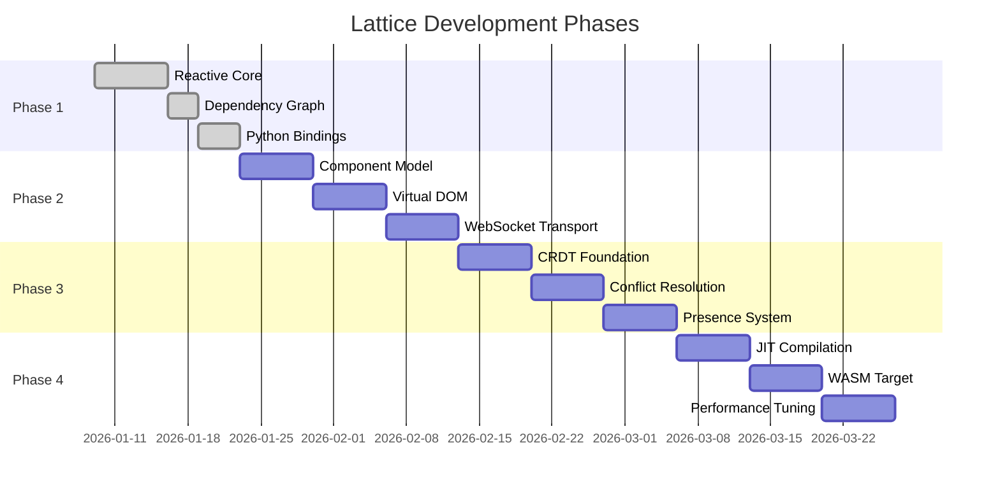
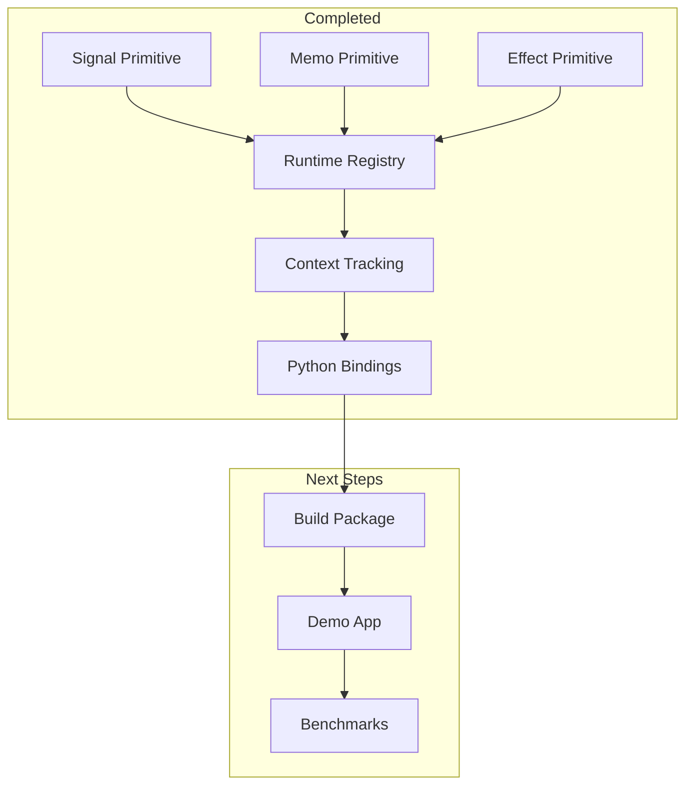
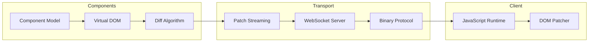
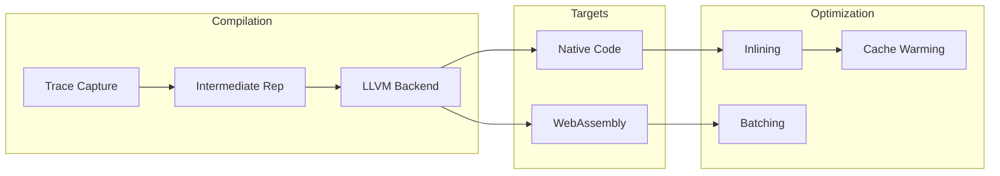

# Lattice Development Roadmap

This document outlines the development plan for Lattice across four phases.

## Timeline Overview



## Phase 1: Core Runtime (CURRENT)

Build the reactive foundation.



### Milestones

| Task | Status | Notes |
| ---- | ------ | ----- |
| Signal with auto-tracking | Done | Rust + Python wrapper |
| Memo with caching | Done | Lazy evaluation |
| Effect with scheduling | Done | Eager execution |
| Runtime registry | Done | Global dependency tracking |
| Python API | Done | Decorators and context |
| Build with maturin | In Progress | Create wheel |
| Demo application | Planned | Compare vs Streamlit |
| Benchmarks | Planned | Performance validation |

## Phase 2: Rendering and Transport

Build UI primitives and network layer.



### Milestones

| Task | Status | Notes |
| ---- | ------ | ----- |
| Component decorator | Planned | Define UI components |
| Virtual DOM tree | Planned | Efficient representation |
| Diff algorithm | Planned | Minimal patch generation |
| WebSocket server | Planned | Tokio-based async |
| MessagePack protocol | Planned | Compact binary format |
| JavaScript client | Planned | Minimal DOM patcher |

## Phase 3: Collaboration Layer

Real-time multi-user support.

```mermaid
flowchart TB
    subgraph CRDT["CRDT Layer"]
        LWW[Last-Write-Wins]
        COUNTER[Counters]
        TEXT[Text (Yjs-style)]
    end
    
    subgraph Sync["Synchronization"]
        VEC[Version Vectors]
        MERGE[Auto-Merge]
        CONFLICT[Conflict Resolution]
    end
    
    subgraph Presence["Presence"]
        CURSOR[Cursor Sharing]
        AWARE[Awareness Protocol]
    end
    
    LWW --> MERGE
    COUNTER --> MERGE
    TEXT --> MERGE
    MERGE --> VEC
    VEC --> CONFLICT
    CONFLICT --> CURSOR
    CURSOR --> AWARE
```

### Milestones

| Task | Status | Notes |
| ---- | ------ | ----- |
| LWW Register CRDT | Planned | Basic conflict-free type |
| Counter CRDT | Planned | For numeric values |
| Text CRDT | Planned | Collaborative editing |
| Version vectors | Planned | Causality tracking |
| Presence system | Planned | User awareness |

## Phase 4: Performance Optimization

Advanced compilation and execution.



### Milestones

| Task | Status | Notes |
| ---- | ------ | ----- |
| Expression tracing | Planned | Capture computation graph |
| LLVM integration | Planned | JIT compilation |
| WASM compilation | Planned | Browser execution |
| Performance benchmarks | Planned | Validation suite |

## Success Metrics

| Metric | Target | Current |
| ------ | ------ | ------- |
| Update latency | < 10ms | TBD |
| Memory per signal | < 100 bytes | TBD |
| Throughput | > 100k updates/sec | TBD |
| Build size (WASM) | < 500KB | N/A |

## Getting Involved

See [CONTRIBUTING.md](../CONTRIBUTING.md) for development guidelines.

Current priority: **Phase 1 completion** - build package and create demo app.
